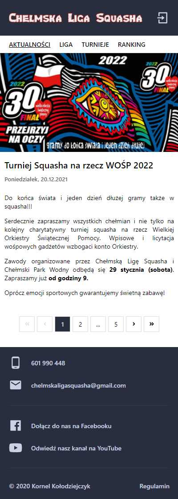

# Chełmska Liga Squasha

> Management and promotion of the league.
> Live demo [_here_](https://www.chelmskaligasquasha.com/).

## Table of Contents

- [General Info](#general-information)
- [Technologies Used](#technologies-used)
- [Features](#features)
- [Screenshots](#screenshots)
- [Setup](#setup)
- [Contact](#contact)

## General Information

- The project was created for the needs of the Chełmska Liga Squasha. It allows to manage the league, collect information about matches, tournaments, etc. Promotes the league and provides information about the conditions of participation in the league.

## Technologies Used

- React
- Node
- MongoDB
- Express
- Redux

## Features

List the ready features here:

### Articles

- Displaying articles related to the topic of current events.
- Adding new Articles.
- Editing existing articles.
- Deleting articles.
- Uploading images.

### League

- Displaying groups, tables and league games sorted by seasons, round and names.
- Adding new groups.
- Deleting groups.
- Entering results of matches by users (only own matches) and admins (all matches).
- Checking validity of entered results.
- Calculating points and positions in the table based on the entered results.

### Tournaments

- Displaying tournaments and tables sorted by seasons.
- Adding new Tournaments.
- Editing existing tournaments.
- Uploading pdf files.
- Deleting tournaments.

### Rankings

- Calculating rankings based on tournaments and leagues data.
- Sorting ranks by league points, tournaments points or total points.

### Users

- Authentication and authorization users.
- Adding users.
- Editing existing users.
- Forget password mechanism.
- Sending e-mails.
- Displaying list of users.

and a lot more..

## Screenshots



## Setup

The project requires node.js and mongodb to be installed. Follow the steps:

- Run local mongodb server.
- Go to the backend folder and type npm install.
- Create .env file and add the following variables:

```
JWT_SECRET=<password>
MONGODB_URL=mongodb://localhost:27017/squash
CLIENT_URL=http://localhost:5000
MAIL_USER=<mail_user>
MAIL_PASSWORD=<mail_password>
```

- Type npm start.
- Go to the frontend folder, type npm install.
- Type npm start.

## Contact

Created by Kornel Kołodziejczyk.  
Address e-mail: kolodziejczyk.contact@gmail.com.  
Feel free to contact me!
